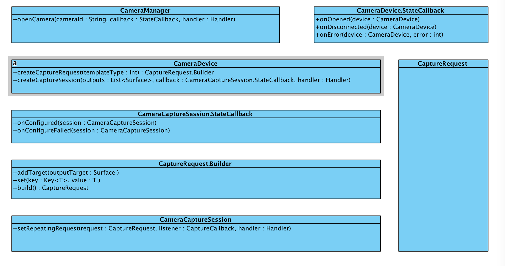

## Using Android Camera2 API Get YUV_420_888
## 使用Android Camera2 API获取YUV数据

涉及到的主要的Class如图：





demo地址在Github

#### Camera2 API使用步骤描述：


1. 通过getSystemService()方法获取系统服务CameraManager
2. 再通过系统服务CameraManager的openCamera方法打开设备
   在使用openCamera方法时需要传入CameraDevice.StateCallback接口，这个接口用来监听CameraDevice的状态。
   CameraDevice.StateCallback接口有三个主要方法需要实现：

       override fun onOpened(cameraDevice: CameraDevice)
       override fun onDisconnected(cameraDevice: CameraDevice)
       override fun onError(cameraDevice: CameraDevice, error: Int)

   重点在onOpen方法。onOpen方法中获取到CameraDevice对象不为空，则表示CameraDevice设备可以开始会话了。

3. 在onOpened方法中<font color=red>准备创建请求</font>，通过CameraDevice.createCaptureRequest(templateType: Int)方法    获取到CaptureRequest.Builder对象，其中templateType参数有以下选项：    

        CameraDevice.TEMPLATE_PREVIEW
        CameraDevice.TEMPLATE_RECORD
        CameraDevice.TEMPLATE_STILL_CAPTURE
        CameraDevice.TEMPLATE_VIDEO_SNAPSHOT
        CameraDevice.TEMPLATE_ZERO_SHUTTER_LAG
        CameraDevice.TEMPLATE_MANUAL     

    预览使用```CameraDevice.TEMPLATE_PREVIEW```    
    视频录制```CameraDevice.TEMPLATE_RECORD```    
    拍照使用```CameraDevice.TEMPLATE_STILL_CAPTURE```    
    手动设置```CameraDevice.TEMPLATE_MANUAL ```    

    > 传入不同的模版参数，系统会自动位CameraDevice设置部分参数，TEMPLATE_MANUAL表示全手动设置

4. 在onOpened方法中创建会话， 通过CameraDevice.createCaptureSession创建会话，此方法需要传入CameraCaptureSession.StateCallback接口，此接口用来监听会话状态。
   CameraCaptureSession.StateCallback接口需要实现两个方法：    

        override fun onConfigured(session: CameraCaptureSession?)
        override fun onConfigureFailed(session: CameraCaptureSession?)

    重点在onConfigured方法。onConfigured中的session参数不会空，则表示会话创建成功，可以开始发送请求。

5. 在onConfigured方法中<font color=red>创建请求</font>，通过步骤3中的CaptureRequest.Builder对象的build()方法创建请求CameraRequest，最后通过CameraCaptureSession.setRepeatingRequest()方法发送请求


#### 获取YUV_420_888数据

此出需要使用ImageReader。通过    
    
    ImageReader.newInstance(int width, int height, int format, int maxImages) $$  
创建ImageReader对象，该方法的第三个参数format需要根据不同场景传入不同的值，如果需要YUV数据就传入google推荐的format参数    
    
    ImageFormat.YUV_420_888 


创建完成ImageReader后需要添加YUV帧数据回调，使用ImageReader.setOnImageAvailableListener方法，传入ImageReader.OnImageAvailableListener接口。此接口需要实现方法：

        void onImageAvailable(ImageReader reader)

在onImageAvailable方法中通过reader对象即可获取到YUV_420_888的byte数据，具体代码如下：    


        val image = reader?.acquireNextImage()
        if (image != null) {
            val buffer = image.planes[0].buffer
            val data = ByteArray(buffer.remaining())
            buffer.get(data)
            Log.d(TAG, "data size = " + data.size + "; $threadName")
            image.close()
        }

在步骤 3 使用CaptureRequest.Builder.addTarget(Surface outputTarget)方法添加设备的数据输出对象，此处有CaptureRequest.Builder.addTarget(ImageReader.surface)    

在步骤 4 使用CameraDevice.createCaptureSession方法创建会话，该方法的第一个参数List<Surface> outputs表示需要穿入设备的数据输出对象，同样需要将ImageReader.surface添加到outputs集合中